# Hermes Security - Deployment Workflow Guide

This guide explains the secure deployment workflow for the Hermes Security project, ensuring that all quality gates pass before any deployment occurs.

## 🎯 Overview

The deployment workflow is designed with **security-first principles**:

- ✅ **Quality gates must pass** before any deployment
- 🚫 **No automatic Vercel deployments** from GitHub
- 🔒 **Manual production deployments only** with explicit confirmation
- 🛡️ **Staging deployment** only after all quality gates pass
- 📋 **Clear failure notifications** when gates don't pass

## 🔄 Deployment Flow

```mermaid
graph TD
    A[Local Development] --> B[Push to GitHub]
    B --> C{Quality Gates}
    C -->|❌ Fail| D[Fix Locally]
    D --> B
    C -->|✅ Pass| E[Deploy to Staging]
    E --> F[GitHub Pages Live]
    F --> G[Manual Production Deploy]
    G --> H[Vercel Production Live]
```



## 🚀 Staging Deployment (Automatic)

### When It Happens
- **Trigger**: Push to `main` branch
- **Condition**: ALL quality gates must pass
- **Destination**: GitHub Pages (staging environment)

### Quality Gates Required
1. **🔍 Code Quality & Linting**
   - ESLint checks
   - Prettier formatting
   - TypeScript type checking
   - CTA Master Rules validation

2. **🏗️ Build Validation**
   - Production build test
   - Staging build test
   - Asset validation
   - Critical file checks

3. **🧪 Testing & Validation**
   - Routing tests
   - Environment tests
   - CDN integration tests
   - Security tests

4. **🛡️ Security & Secrets Check**
   - Secret detection
   - Dependency security audit
   - Environment variable validation

5. **⚡ Performance Check**
   - Bundle size analysis
   - Performance budget validation
   - Asset optimization check

### What Happens If Gates Fail
- ❌ **Staging deployment is BLOCKED**
- 📋 **Clear failure report** with specific gate that failed
- 🔧 **Fix required locally** before retry
- 🚫 **No deployment occurs** until all gates pass

## 🏭 Production Deployment (Manual Only)

### How to Deploy to Production

1. **Ensure staging is working**
   - Verify staging deployment is live and functional
   - Test all features on staging environment

2. **Trigger manual deployment**
   - Go to GitHub Actions → "Manual Production Deployment"
   - Click "Run workflow"
   - Select environment: `production`
   - Type `DEPLOY` in confirmation field
   - Click "Run workflow"

3. **Quality gates run automatically**
   - Essential quality gates are re-checked
   - Build validation occurs
   - Security checks run

4. **Deployment proceeds**
   - Only if quality gates pass
   - Vercel handles the actual deployment
   - Production URL becomes live

### What Happens If Production Gates Fail
- ❌ **Production deployment is BLOCKED**
- 📋 **Detailed failure report** provided
- 🔧 **Fix issues locally** and retry
- 🚫 **No production deployment** until gates pass

## 🛡️ Security Features

### Vercel Auto-Deployment Disabled
- **Configuration**: `vercel.json` disables auto-deployment
- **Branches affected**: `main` and `develop`
- **Result**: No automatic production deployments from GitHub

### Branch Protection Rules
- **Required**: Pull request reviews
- **Required**: All quality gates must pass
- **Required**: Signed commits
- **Blocked**: Force pushes and direct pushes to main

### Manual Override Protection
- **No bypass**: Even administrators must follow the process
- **Explicit confirmation**: Must type "DEPLOY" to confirm
- **Quality gates**: Always run before production deployment

## 📋 Quality Gates Details

### Code Quality & Linting
```bash
# What runs:
npm run lint                    # ESLint checks
npx prettier --check           # Formatting validation
npx tsc --noEmit              # TypeScript type checking
npm run validate:cta          # CTA Master Rules validation
```

### Build Validation
```bash
# What runs:
npm run build:staging         # Staging build test
npm run build:production      # Production build test
# Asset validation checks
# Critical file existence checks
```

### Testing & Validation
```bash
# What runs:
npm run test:routing          # Routing functionality tests
npm run test:all-envs         # Environment configuration tests
npm run test:cdn              # CDN integration tests
npm run test:captcha          # Security feature tests
```

### Security & Secrets Check
```bash
# What runs:
# Secret pattern detection in code
npm audit --audit-level=high  # Dependency security audit
# Environment variable validation
```

### Performance Check
```bash
# What runs:
npm run build:production      # Production build
# Bundle size analysis
# Performance budget validation (512KB limit)
```

## 🚨 Troubleshooting

### Common Issues

#### Quality Gates Failing
1. **Check the specific failing gate** in GitHub Actions logs
2. **Run the same command locally** to reproduce the issue
3. **Fix the issue** in your local environment
4. **Test thoroughly** before pushing again
5. **Push only after** all issues are resolved

#### Staging Deployment Blocked
- **Cause**: One or more quality gates failed
- **Solution**: Fix the failing gates locally first
- **Prevention**: Always test quality gates locally before pushing

#### Production Deployment Blocked
- **Cause**: Quality gates failed during manual deployment
- **Solution**: Fix issues and retry manual deployment
- **Prevention**: Ensure staging is working before production deployment

### Getting Help

1. **Check GitHub Actions logs** for detailed error messages
2. **Review quality gate configuration** in workflow files
3. **Run commands locally** to reproduce issues
4. **Check branch protection rules** are properly configured

## 📊 Monitoring & Alerts

### Success Notifications
- ✅ **Staging deployment successful**
- ✅ **All quality gates passed**
- ✅ **Production deployment initiated**

### Failure Notifications
- ❌ **Quality gates failed**
- ❌ **Deployment blocked**
- ❌ **Specific gate that failed**
- 🔧 **Action required to fix**

## 🔧 Local Development

### Pre-Push Checklist
Before pushing to GitHub, run these commands locally:

```bash
# 1. Code quality checks
npm run lint
npx prettier --check "src/**/*.{ts,tsx,js,jsx,json,css,md}"
npx tsc --noEmit

# 2. Build validation
npm run build:staging
npm run build:production

# 3. Testing
npm run test:routing
npm run test:all-envs
npm run test:cdn
npm run test:captcha

# 4. Security check
npm audit --audit-level=high

# 5. Performance check
npm run build:production
# Check bundle size manually
```

### Environment Setup
```bash
# Install dependencies
npm ci

# Run development server
npm run dev

# Run all quality gates locally
npm run quality-gates
```

## 📝 Best Practices

### Development Workflow
1. **Work on feature branches** (not directly on main)
2. **Test quality gates locally** before pushing
3. **Create pull requests** for all changes
4. **Wait for quality gates** to pass before merging
5. **Verify staging deployment** after merge

### Production Deployment
1. **Always test staging first** before production
2. **Use manual deployment** for production releases
3. **Confirm with "DEPLOY"** only when ready
4. **Monitor deployment** for any issues
5. **Verify production** after deployment

### Security
1. **Never bypass quality gates** for "quick fixes"
2. **Always use signed commits** for production
3. **Review all changes** before production deployment
4. **Keep dependencies updated** and secure
5. **Monitor for security alerts**

---

## 🎉 Summary

This deployment workflow ensures:

- **🛡️ Security**: No accidental production deployments
- **🔍 Quality**: All code meets high standards
- **🚀 Reliability**: Staging deployment only after all checks pass
- **📋 Control**: Manual production deployments with explicit confirmation
- **🔄 Consistency**: Enforced workflow across all deployments

**Remember**: Quality gates are your friend! They prevent bad code from reaching production and ensure a reliable, secure deployment process.
